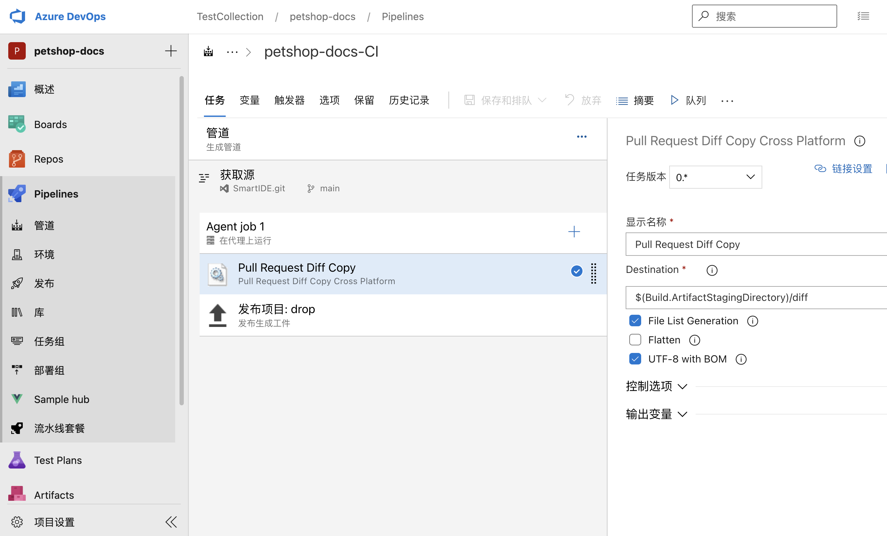

# Copy Pull Reqeust Changed Files 

When you deploy scripts or static resource files to your environment, you may just want to update changed files instead of deploying all files (HTML, JS, CSS, PHP, Python), because it may take time. So this pipeline extension can help you to do incremental deployment more easily.

### Prerequisites

* Repository must be Git.
* Build must be trigged by pull request, [setup branch policy to trigger a build during Pull Request](https://docs.microsoft.com/zh-cn/vsts/git/branch-policies?view=vsts#require-the-pull-request-to-build). If the build is not triggered by a Pull Request, the task will just skip and do nothing.

### Supported Platforms

* Azure DevOps Service && Azure DevOps Sever(on-promise)
* Windows Build Agents & Linux Build Agents (You need to use task with 'Cross Platform’, the original task is left in the list for backward compatibility) 

## User Guide

1. Search and add "Pull Request Diff Copy Cross Platform" task to your pipeline, and set "Destination" parameter.

2. Trigger new build from Pull Request, if you want to know more about how to setup branch policy, please refer to: [setup branch policy to trigger a build during Pull Request](https://docs.microsoft.com/zh-cn/vsts/git/branch-policies?view=vsts#require-the-pull-request-to-build). 

3. You can also use "Publish build artifacts" task to store the incremental files to your build artifacts.

### Business  Support

Please feel free to contact us by email: henryli@leansoftx.com

--------------------------------------------------------------------

### Pull Reqeust 变更文件复制流水线插件介绍

当你使用Azure DevOps进行脚本或者静态资源的部署时，往往只需要更新或部署变更的文件，而不是部署所有的静态资源文件或者脚本文件。
比如HTML、JS、CSS、PHP、Python等文件或脚本。所以此插件非常适合增量部署等场景。

### 前置条件

* 代码仓库必须为GIT仓库，不支持TFVC.
* 流水线必须是通过Pull Request触发的.

### 支持平台

* Azure DevOps Service && Azure DevOps Sever(本地部署版)
* Windows 构建代理 & Linux 构建代理 (请使用Pull Request Diff Copy Cross Platform任务) 

### 使用说明

1. 在Pipeline的特定阶段下，添加对应的 "Pull Request Diff Copy Cross Platform" 任务, 并设置Destination参数（将更改文件复制到的目标文件夹）

2. 通过Pull Request触发对应的流水线执行，关于分支策略的配置方式可以参考微软官方操作手册：[分支策略配置](https://docs.microsoft.com/zh-cn/vsts/git/branch-policies?view=vsts#require-the-pull-request-to-build)

3. 可以结合 “发布生成工件” 任务将更新的文件发布到流水线制品中进行存档，以便后续进行增量部署，如下图所示：

### 商业支持

如有任何问题可以通过邮件与我们联系：henryli@leansoftx.com